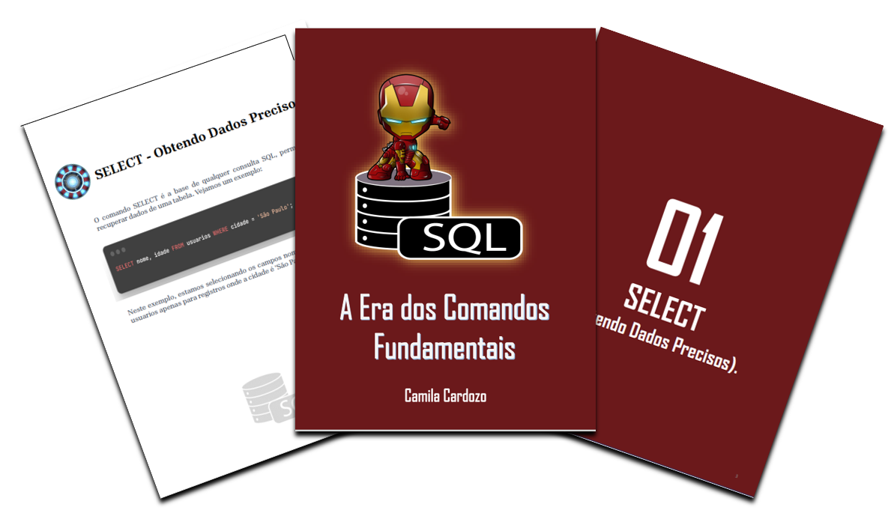

    

# Projeto EBOOK Gerado por I.A.s

 > ℹ️ **NOTE:** Este é o repositório desenvolvido durante o curso.

Projeto com o objetivo de gerar um ebook digital com as facilidades das ferramentas de IA. 

<a href="https://github.com/CamilaFCardozo/prompts-recipe-to-create-a-ebook/tree/main/output/ebook%20-%20css%20jedi%20output.pdf" title="View PDF now"> 📕Clique aqui para ler</a>

## 💻 Tecnologias utilizadas no projeto

- [ChatGPT](https://chat.openai.com/) 
- [PowerPoint](https://www.microsoft.com/en/microsoft-365/powerpoint)

## ✨ Features

- Conteúdo gerado via ChatGPT

## 📚 Materiais

- Imagens utilizadas em `assets`
- ebook e prompts gerados durante as aulas em `output`

## 🛠️ Instruções de execução

Utilize os prompts presentes no material e as ferramentas sugeridas para gerar o material base e utilize uma ferramenta de edição de documentos como power point, libreoffice , indesign para diagramação.

  

---
